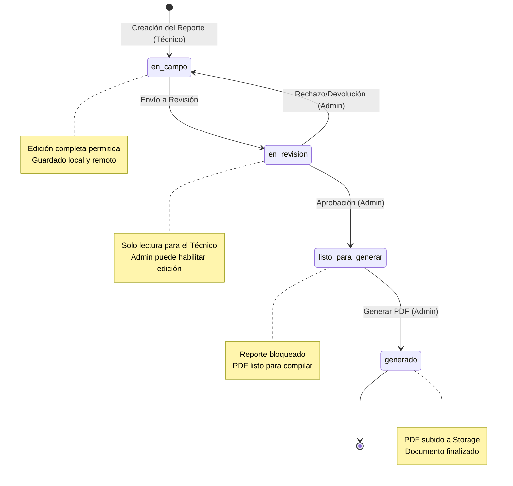
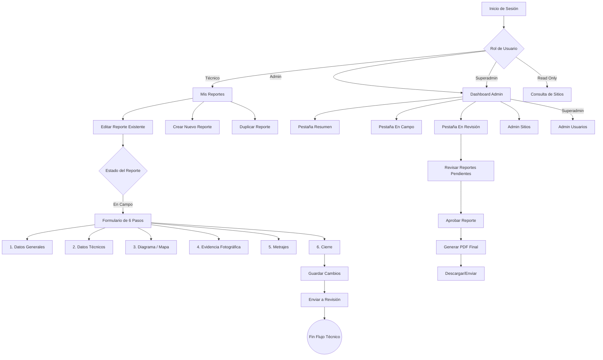

# Flujos y Estados del Sistema

Esta sección describe el ciclo de vida de un reporte y cómo interactúan los diferentes roles en el sistema.

## Roles del Sistema

El sistema gestiona cuatro roles con permisos diferenciados:

1.  **Superadministrador (`superadmin`):**
    -   Todos los permisos de administrador.
    -   Gestión de usuarios (crear cuentas, asignar roles).
    -   Gestión de sitios (crear, editar, eliminar, importar/exportar).
    -   Acceso a `/admin/usuarios` y `/admin/sitios`.

2.  **Administrador (`admin`):**
    -   Acceso global a todos los reportes.
    -   Gestión de sitios (crear, editar, eliminar, importar/exportar).
    -   Revisa reportes enviados (`en_revision`).
    -   Aprueba reportes para generación (`listo_para_generar`).
    -   Genera el PDF final y lo firma (`generado`).
    -   Capacidad de habilitar/deshabilitar edición en fases avanzadas.
    -   Acceso a `/admin/sitios`.

3.  **Técnico de Campo (`field_worker`):**
    -   Crea y edita reportes en estado `en_campo`.
    -   Envía reportes para revisión (`en_revision`).
    -   Visualiza reportes asignados en "Mis Reportes".
    -   Se asigna a un grupo de trabajo (`grupo_a` o `grupo_b`).

4.  **Solo Lectura (`read_only`):**
    -   Consulta de sitios y reportes sin capacidad de modificación.
    -   Acceso de lectura a `/admin/sitios`.

## Ciclo de Vida del Reporte

El reporte avanza a través de una máquina de estados definida. Los cambios de estado son unidireccionales para asegurar la integridad de los datos, salvo intervenciones administrativas.

## Flujo de Trabajo del Usuario

El siguiente diagrama ilustra la interacción típica de un usuario con la aplicación:

## Descripción de los Pasos del Formulario

El proceso de edición (`ReportEdit`) se divide en 6 pasos lógicos para facilitar la recolección de datos en móviles:

1.  **Datos generales y ubicación:** Selección del sitio, fecha, tipo de instalación, nivel de seguridad.
2.  **Datos técnicos e infraestructura:** Varía según el tipo de sitio:
    -   *LPR:* Formulario especializado (sentido vial, estructura).
    -   *Cotejo Facial:* Formulario especializado.
    -   *General:* Conectividad (Fibra, Radio), hardware existente.
3.  **Diagrama y mapa:** Mapa interactivo con [marcadores de infraestructura](../guides/map_markers), leyenda técnica y captura PNG.
4.  **Evidencia fotográfica:** Carga de fotos con compresión automática y [editor de anotaciones](../guides/image_editor).
5.  **Metrajes y obra civil:** Distancias (cables, zanjas), detalles de acometida, punto de cámara, PTZ.
6.  **Cierre:** Responsable del sitio y observaciones finales.

## Rutas del Sistema

| Ruta | Componente | Acceso |
|---|---|---|
| `/login` | Login | Público |
| `/` | Dashboard / Redirect | Autenticado |
| `/mis-reportes` | Mis Reportes | Autenticado |
| `/reporte/:id` | Edición de Reporte | Autenticado |
| `/reportes-finales` | Reportes Finales | Autenticado |
| `/admin/sitios` | Administración de Sitios | admin, superadmin, read_only |
| `/admin/usuarios` | Administración de Usuarios | superadmin |
