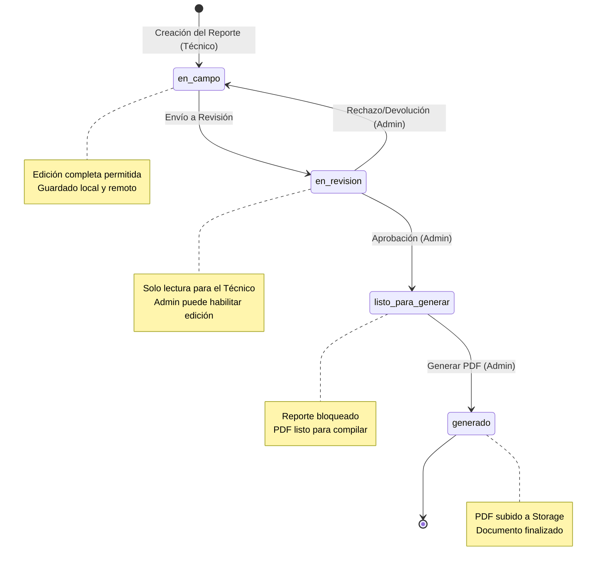
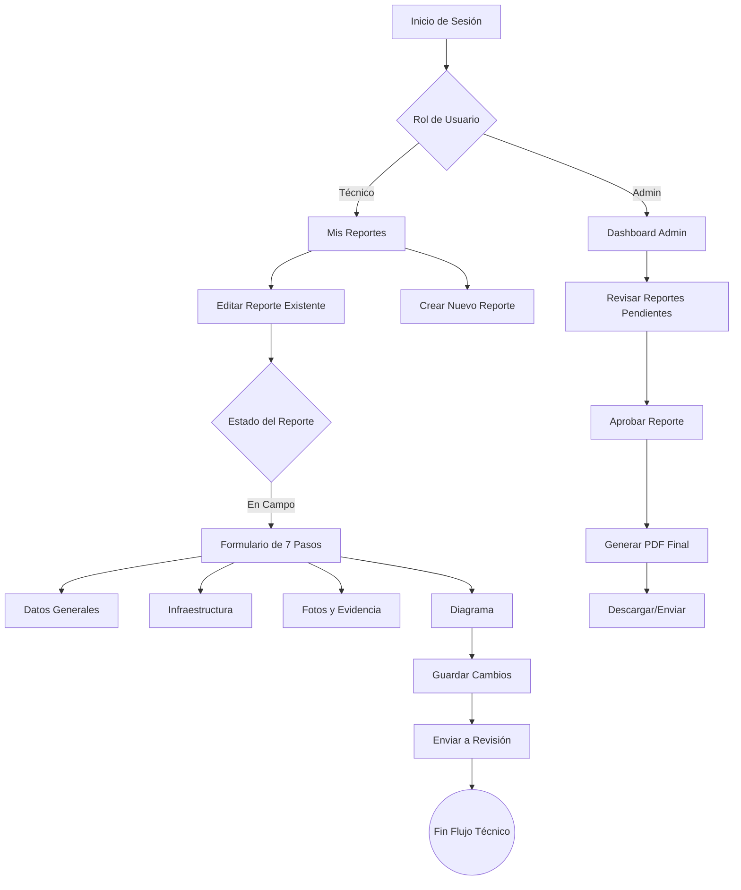

# Flujos y Estados del Sistema

Esta sección describe el ciclo de vida de un reporte y cómo interactúan los diferentes roles en el sistema.

## Roles del Sistema

El sistema gestiona dos roles principales con permisos diferenciados:

1.  **Técnico de Campo (`field_worker`):**
    -   Crea y edita reportes en estado `en_campo`.
    -   Envía reportes para revisión (`en_revision`).
    -   Visualiza reportes asignados en "Mis Reportes".

2.  **Administrador (`admin`):**
    -   Acceso global a todos los reportes.
    -   Revisa reportes enviados (`en_revision`).
    -   Aprueba reportes para generación (`listo_para_generar`).
    -   Genera el PDF final y lo firma (`generado`).
    -   Capacidad de habilitar/deshabilitar edición en fases avanzadas.

## Ciclo de Vida del Reporte

El reporte avanza a través de una máquina de estados definida. Los cambios de estado son unidireccionales para asegurar la integridad de los datos, salvo intervenciones administrativas.

## Flujo de Trabajo del Usuario

El siguiente diagrama ilustra la interacción típica de un usuario con la aplicación:

## Descripción de los Pasos del Formulario

El proceso de edición (`ReportEdit`) se divide en 7 pasos lógicos para facilitar la recolección de datos en móviles:

1.  **Datos generales y ubicación:** Información básica del sitio (LPR, Cotejo, Dirección).
2.  **Seguridad, contrato y observaciones:** Niveles de seguridad y notas iniciales.
3.  **Datos técnicos e infraestructura:** Conectividad (Fibra, Radio), Hardware existente.
4.  **Diagrama y mapa:** Edición visual sobre mapa satelital (Croquis).
5.  **Evidencia fotográfica:** Carga de fotos de puntos clave (Acometida, Vista de cámara).
6.  **Metrajes y civil:** Distancias (Cables, Zanjas) y detalles de obra civil.
7.  **Cierre y guardado:** Observaciones finales y firma del responsable.
